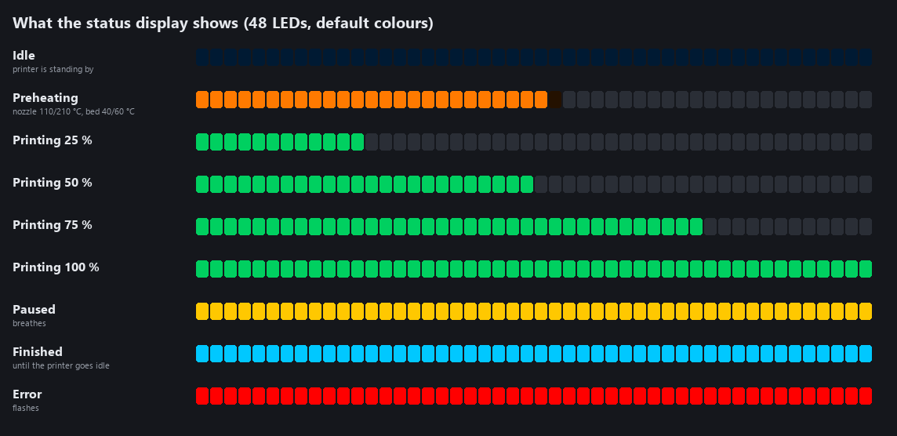
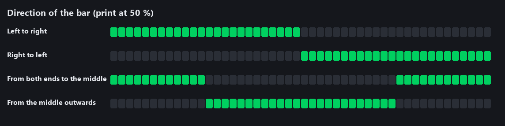
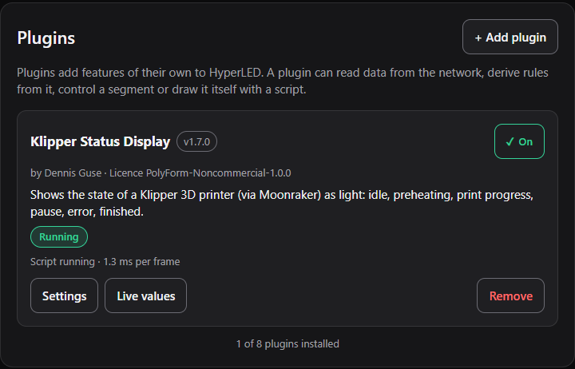
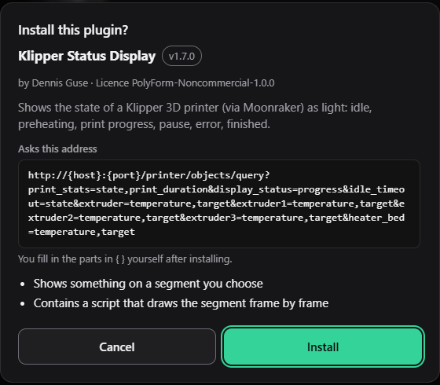
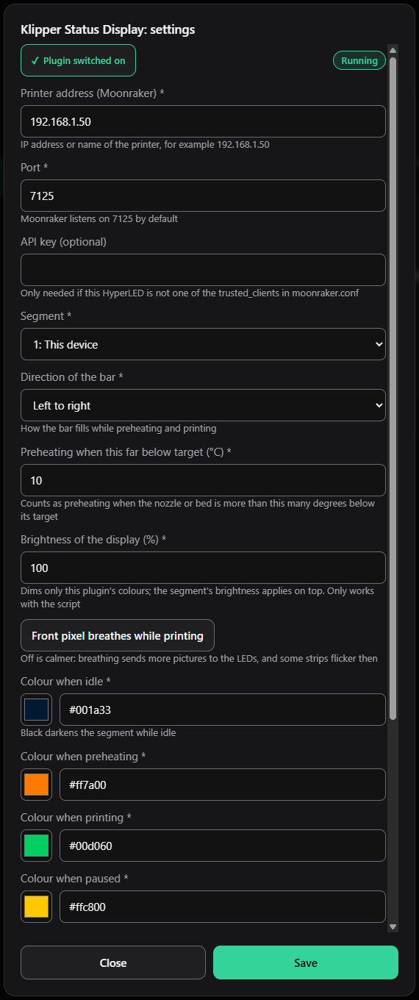
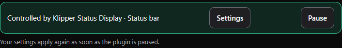
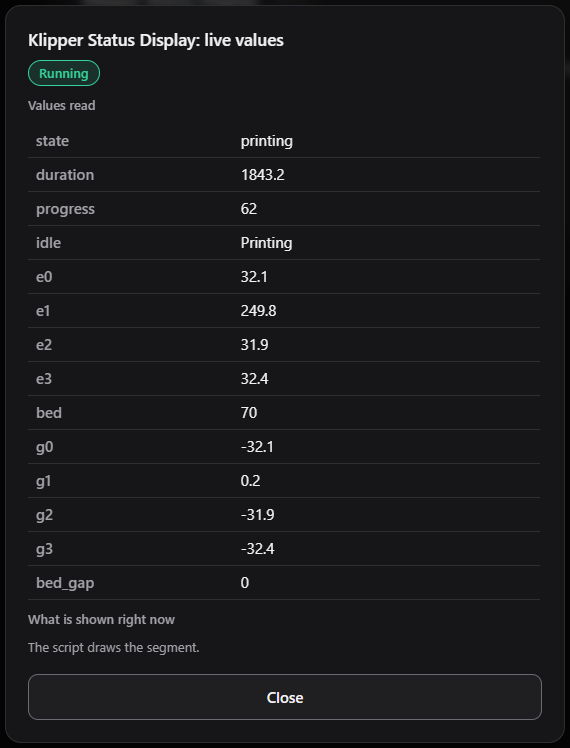

# HyperLED plugin: Klipper Status Display

*English · [Deutsch](README.de.md)*

A plugin for [**HyperLED**](https://github.com/KaelanTesseract/HyperLED), the ESP32-S3 LED controller, that shows the state of a 3D printer running **Klipper** and **Moonraker** as light: idle, preheating, print progress, pause, error and finished.

It is **a single file** ([`klipper-status.json`](klipper-status.json)). It installs without a firmware update and is set up in HyperLED's web interface. It has been **tested with a Snapmaker U1**.



> **Where the idea comes from.** Showing a printer's state as a status bar of light is the idea of **drc85** and his
> [Snapmaker U1 SnapStatus LED Status Bar (WLED, ESP32)](https://makerworld.com/en/models/2686608-snapmaker-u1-snapstatus-led-status-bar-wled-esp32)
> on MakerWorld, which in turn builds on the WLED usermod *Klipper Percentage*. That page is also where you find the
> **3D-printable parts** (mounts for the build plate, the bottom and the top of the U1) to build the status bar itself.
> This plugin is an **independent new development** for HyperLED's plugin system and contains **no code** from either
> of them. If you run WLED rather than HyperLED, go and look at drc85's project.

## Contents

- [What it does](#what-it-does)
- [How the bar behaves on strips and panels](#how-the-bar-behaves-on-strips-and-panels)
- [Requirements](#requirements)
- [Installing](#installing)
- [Settings](#settings)
- [What is asked of Moonraker](#what-is-asked-of-moonraker)
- [Building the plugin yourself](#building-the-plugin-yourself)
- [Tested with, and known issues](#tested-with-and-known-issues)
- [The idea, and the hardware](#the-idea-and-the-hardware)
- [About HyperLED](#about-hyperled)
- [License](#license)

## What it does

Every five seconds the plugin asks the printer (through Moonraker) for its state, the print progress and the temperatures
of the nozzles and the heated bed. A small Lua script turns that into a picture on the LED segment you chose. The
picture changes with the state of the printer:

| Printer state | What the segment shows | Without the script (fallback) |
|---|---|---|
| **Idle** (`standby`, `cancelled`, or finished and idle) | a dim colour (dark blue by default; black switches the segment off) | the same colour |
| **Preheating** | an orange bar that fills as the heaters approach their targets, breathing slowly | *Breathing* effect in orange |
| **Printing** (`printing`) | a green bar that fills with the print progress | *Solid* effect in green |
| **Paused** (`paused`) | the whole segment breathes in yellow | *Breathing* effect in yellow |
| **Finished** (`complete`) | the whole segment in cyan, until the printer goes idle | *Solid* effect in cyan |
| **Error** (`error`) | the whole segment flashes red | *Strobe* effect in red |
| **No connection** (printer off, Moonraker unreachable) | a colour of your choice (black = off by default) | the same colour |

All colours can be changed in the settings.

### Idle

When nothing is happening the segment shows one dim colour, so you can see that the display is alive and connected.
The Klipper states `standby` and `cancelled` count as idle, and so does a finished print once the printer has gone idle
(see *Finished* below). Set the colour to black if you want the segment dark while idle.

### Preheating

Preheating is detected from the temperatures, not from a button. It counts as preheating while the printer is in
`standby`, or has just started a print and not yet extruded anything (Klipper keeps `print_duration` at 0 until
then), **and** at least one heater (any of up to four nozzles, or the bed) is more than *Preheating when this far below
target* (default 10 °C) below its target.

The bar then shows how far the heaters have come: for every heater that is asked to heat, the plugin works out
`temperature ÷ target`, and the **heater that is furthest behind decides** how long the bar is. A bed that is still
cold therefore keeps the bar short even if the nozzle is already hot. The whole bar breathes, so it is plain to see
that the printer is waiting for something. At least one LED is always lit, so a bar that is still near 0 % never looks
like a dark strip.

### Printing

While Klipper reports `printing` (and has begun extruding) the bar follows the **print progress** from
`display_status.progress`: the value of the last `M73` in the G-code, or otherwise the share of the file that has been
read. Where the bar ends in the middle of an LED, that LED is lit in proportion, so the bar grows smoothly even on a
short strip.

The bar **only grows**. A slicer's progress can step back a little (it comes from the last `M73`), and a bar that jumps
back by a few LEDs looks like flickering. If the reported progress falls by less than 30 percentage points within a
print, the bar stays where it was. A bigger fall, or a new print, starts a new bar. Optionally the pixel at the growing
end of the bar breathes (*Front pixel breathes while printing*), which shows at a glance that the print is alive.

### Paused, finished, error

- **Paused**: the whole segment breathes in the pause colour (yellow by default).
- **Finished**: after a print Klipper stays in `complete` until a new file is loaded, which could be days. So the plugin
  shows the finished colour (cyan) only **until the printer goes idle** (Klipper's `idle_timeout`, ten minutes by
  default), and only if *Show "finished"* is on. After that the idle colour returns.
- **Error**: the whole segment flashes in the error colour, 250 ms on and 250 ms off.

### No connection

When the printer does not answer (switched off, network down, Moonraker not running), the plugin waits for a few failed
requests and then shows the *Colour without connection*. Black, the default, means the segment goes dark. The plugin
does not keep showing a stale state.

### Never touches your brightness

HyperLED's brightness sliders act literally, and this plugin never moves them. Everything it shows is an overlay on the
segment that is never saved. Switch the plugin off or remove it and the segment is at once what you had set. The
setting *Brightness of the display* dims only this plugin's own colours.

## How the bar behaves on strips and panels

The plugin works out for itself how the segment you chose is laid out, and needs no setting for it:

- A **panel**, a **plain strip** and anything on a **Slave** fills along the columns; the *Direction* applies from
  left to right.
- If the Master has a **matrix** set up in its device settings (for instance 64 × 64 for the canvas) although only a
  strip hangs on it, the strip lies on that canvas row by row. HyperLED notices this and tells the script, and the bar
  then runs **along the LEDs of the strip** in the order you would expect; the *Direction* applies along the strip.

This needs a firmware that describes the segment to the script (`settings._layout`, see
[Plugin scripts](https://github.com/KaelanTesseract/HyperLED/blob/main/docs/en/11_Plugin_Skripte.md)). With an older
firmware, such a strip fills from both ends.

The **direction** of the bar is a setting:



*(Pictures: the plugin's own script run on a simulated 48-LED strip with the default colours,
rendered by [`tools/render_states.py`](tools/render_states.py).)*

## Requirements

- HyperLED with **plugin and script support** (Master firmware 0.3.000 or newer). If the segment runs on a **Slave**,
  the Slave needs firmware 0.3.001 or newer for the bar (this plugin has more settings than fit into the single packet that 0.3.000 uses); an older Slave shows the fallback column of the table above.
- A printer with **Klipper** and **Moonraker** that HyperLED can reach on the network. Moonraker listens on port
  **7125** by default.
- For addresses that are not among the `trusted_clients` in its `moonraker.conf`, Moonraker asks for an **API key**.
  Enter it in the plugin (field *API key*). If your HyperLED is among the `trusted_clients`, leave the field empty.

## Installing

1. Download [`klipper-status.json`](klipper-status.json), or use the file attached to the latest
   [release](https://github.com/KaelanTesseract/HyperLED-Plugin-Klipper-Status/releases).
2. In HyperLED open **Settings → Plugins → + Add plugin** and choose the file, or enter the file's address under
   **Or load from an address**.

   

3. HyperLED checks the file and shows what it wants to do **before anything is saved**: where it looks, and that it
   draws on a segment and contains a script. Confirm with *Install*.

   

4. The plugin's **settings** open. Enter the **printer address**, choose the **segment**, and switch the plugin on.

   

The address in the screenshots (`192.168.1.50`) is only an example; use the address of your own printer.

Once it runs, the light page tells you which segment the plugin controls and offers to open its settings or to
**pause** it, after which your own settings apply again:



**Live values** on the plugin's card shows what the plugin has read from the printer right now, and who is drawing the
segment. It is the quickest way to find a wrong address or a value that does not arrive:



*(The screenshots show HyperLED's web interface in English. It also speaks German and Russian.)*

## Settings

| Setting | Meaning | Default |
|---|---|---|
| Printer address | IP address or name of the printer | – |
| Port | Moonraker's port | 7125 |
| API key | only needed if HyperLED is not among the `trusted_clients` (never shown again and never leaves the device) | empty |
| Segment | the segment that the display takes over | – |
| Direction of the bar | left to right, right to left, from both ends to the middle, or from the middle outwards | left to right |
| Preheating when this far below target | how many °C a nozzle or the bed must be below its target to count as preheating | 10 |
| Front pixel breathes while printing | the pixel at the growing end of the bar breathes. Off is calmer: every picture sent to the LEDs can trigger a flicker on some strips | off |
| Brightness of the display | dims the plugin's colours (5 to 100 %); the segment's own brightness applies on top. Only works with the script | 100 |
| Colours | idle, preheating, printing, paused, finished, error, without connection | see the plugin |
| Show "finished" | show the finished colour after a print | on |

## What is asked of Moonraker

One single `GET` every five seconds:

```
http://<address>:<port>/printer/objects/query?print_stats=state,print_duration&display_status=progress&idle_timeout=state&extruder=temperature,target&extruder1=temperature,target&extruder2=temperature,target&extruder3=temperature,target&heater_bed=temperature,target
```

This is what is read:

| Value | Source in the answer | Meaning |
|---|---|---|
| `state` | `print_stats.state` | `standby`, `printing`, `paused`, `complete`, `cancelled` or `error` |
| `duration` | `print_stats.print_duration` | print time; stays 0 until filament is fed (this is how preheating before the first stroke is recognised) |
| `progress` | `display_status.progress` · 100 | progress in percent: the value of the last `M73`, otherwise the share of the file read (as in Klipper's documentation) |
| `idle` | `idle_timeout.state` | `Idle`, `Ready` or `Printing` |
| `e0` to `e3`, `bed` | `extruder`, `extruder1` to `extruder3`, `heater_bed` | temperature of the nozzles and the bed; a nozzle the printer does not have is simply missing |
| `g0` to `g3`, `bed_gap` | the same | how far the heater is below its target (target minus actual) |

Moonraker leaves out objects or fields that do not exist; the plugin treats them as "unknown". If Moonraker repeatedly
does not answer, the state is "no connection". Nothing is ever written to the printer: the plugin only reads.

## Building the plugin yourself

A plugin is plain JSON, and JSON has no multi-line strings. So the Lua script lives in
[`src/klipper-status.lua`](src/klipper-status.lua) and the rest in
[`src/klipper-status.template.json`](src/klipper-status.template.json). `build.py` puts the script into the `script`
field and writes `klipper-status.json`:

```bash
python build.py
```

HyperLED checks the finished file in full on installing (`POST /api/plugins/preview` checks it without saving
anything). The format is described in
[Developing plugins](https://github.com/KaelanTesseract/HyperLED/blob/main/docs/en/10_Plugins_entwickeln.md) and
[Plugin scripts](https://github.com/KaelanTesseract/HyperLED/blob/main/docs/en/11_Plugin_Skripte.md).

The pictures in this README are made by [`tools/render_states.py`](tools/render_states.py), which runs the plugin's own
script (needs `pip install pillow lupa`).

## Tested with, and known issues

**Tested with a Snapmaker U1**, a Klipper printer with **four toolheads**. Progress and the temperatures of the
nozzle that is printing arrive correctly, all four nozzles and the bed are read for the preheating bar, and the bar
runs over an LED strip on a HyperLED Master. The plugin was also taken through every state with a replica of Moonraker's
answers (idle, preheating by hand and at the start of a print, printing at 0/25/50/100 %, pause, finished with and
without idle, cancelled, error, and the printer going away).

It is built against the documentation of Moonraker and Klipper and against Klipper's source (`print_stats`): the state
names, fields and the form of the query come from there. Other printers may differ, for example one with more than four
extruders (those are not read) or without `M73` in the G-code. If you try it on another printer, you are welcome to
report the result as an issue.

**Known:** on some LED strips that are powered from a USB port without a strong supply of their own, LEDs behind the end
of the bar can flash briefly. That comes from the power supply and the strip's data signal, not from the plugin. What
helps: a supply with enough current, a 330 Ω resistor in the data line, a capacitor across 5 V and ground at the start
of the strip, and a level shifter (74AHCT125) from 3.3 V to 5 V.

## The idea, and the hardware

The idea of showing the state of a Klipper printer as a bar of light comes from **drc85**:
[Snapmaker U1 SnapStatus LED Status Bar (WLED, ESP32)](https://makerworld.com/en/models/2686608-snapmaker-u1-snapstatus-led-status-bar-wled-esp32)
on MakerWorld ([source code on GitHub](https://github.com/drc85/U1-SnapStatus)), which builds on the WLED usermod *Klipper Percentage*. That page has the **3D-printable parts** for the
status bar of a Snapmaker U1: a mount for the build plate, one for the bottom and one for the top. You print those and
put in a strip of WS2812B LEDs; this plugin is what makes the strip show the printer's state when HyperLED is the
controller behind it.

This plugin is an independent new development for HyperLED. It does not contain code from drc85's project or from the
WLED usermod. It does not copy their colour scheme either; it has its own states (see the table above).

## About HyperLED

[**HyperLED**](https://github.com/KaelanTesseract/HyperLED) is an ESP32-S3 LED controller with a glassmorphism web
interface, effects, scenes, matrix panels, Master/Slave sync over a wired bus or ESP-NOW, MQTT with Home Assistant
discovery, over-the-air updates and **plugins** like this one. Start with
[Using plugins](https://github.com/KaelanTesseract/HyperLED/blob/main/docs/en/09_Plugins_nutzen.md) if you want to know
what a plugin is and what it may do, and with
[Developing plugins](https://github.com/KaelanTesseract/HyperLED/blob/main/docs/en/10_Plugins_entwickeln.md) if you
want to write your own.

This plugin is a separate repository and not part of HyperLED's firmware; like HyperLED it is licensed under the
EUPL-1.2.

## License

Copyright (c) 2026 Dennis Guse.

This plugin is open source under the [**European Union Public Licence 1.2 (EUPL-1.2)**](LICENSE), the same license as
HyperLED itself. You may use, change and share it, including for commercial purposes, under the terms of the license.

The plugin file names its license in its `license` field (`EUPL-1.2`), and the script carries a license header.
